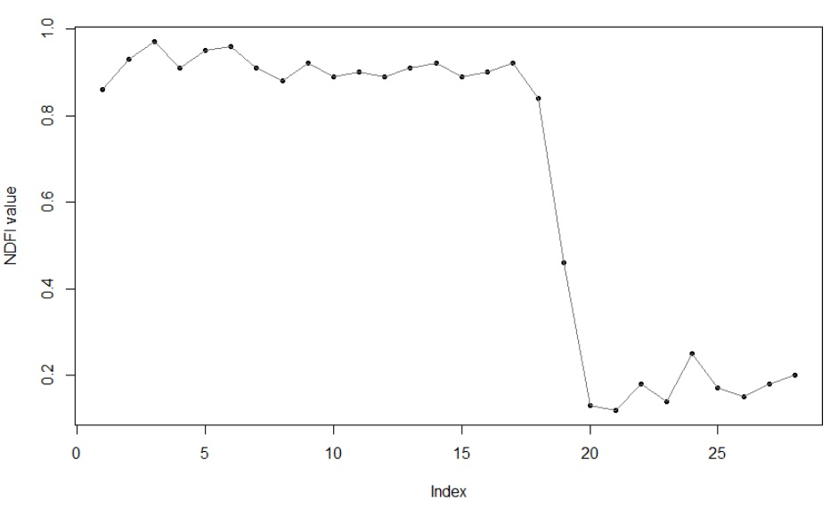
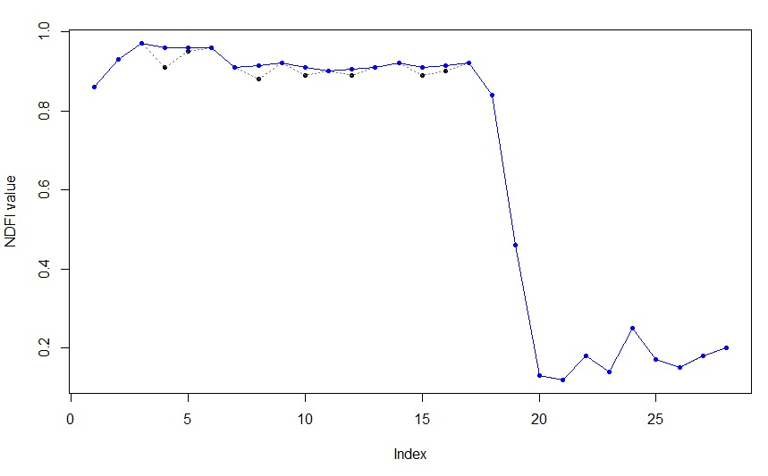
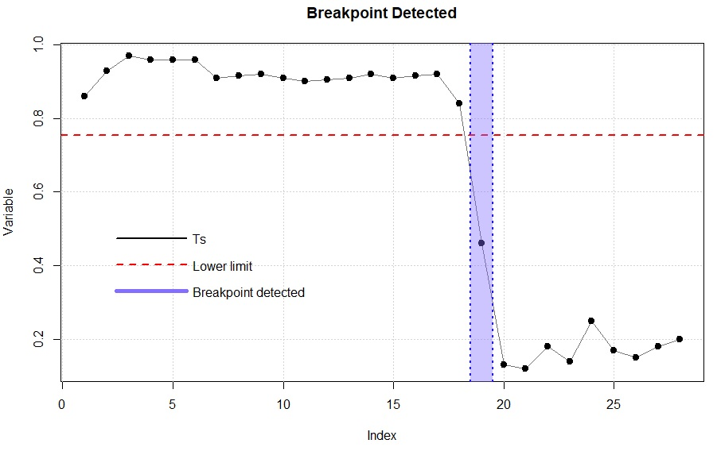
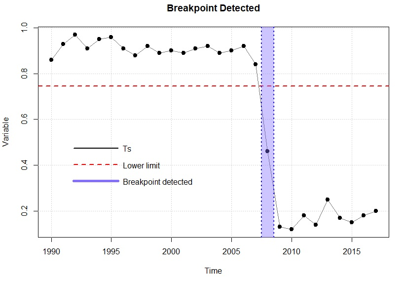

[](https://opensource.org/licenses/MIT)
[](https://codecov.io/gh/csaybar/ForesToolboxRS?branch=dev)
[](https://www.tidyverse.org/lifecycle/#experimental)
[](https://paypal.me/APROGIS?locale.x=es_XC)


# ForesToolboxRS

**ForesToolboxRS** is an initiative that is inspired by the work of [Tarazona, Y., Mantas, V.M., Pereira, A.J.S.C. (2018). Improving tropical deforestation detection through using photosynthetic vegetation time series (PVts-Beta). Ecological Indicators, 94, 367-379.](https://doi.org/10.1016/j.ecolind.2018.07.012).


# Funding

The development of this package was funded by [American Program in GIS and Remote Sensing (APROGIS)](https://www.apgis-rs.com/). ARROGIS was established in 2018 as a leading scientific institution and pioneer in the field of Remote Sensing and Geographic Information Systems (GIS). APROGIS promotes the use of state-of-the-art space technology and earth observation for the sustainable development of states. It is an institution capable of generating new knowledge through publications in different journals in the field of Remote Sensing. More about APROGIS [here](https://www.apgis-rs.com/acerca-de-nosotros/mision-y-vision).

# Introduction

**ForesToolboxRS** is a R package that was created to provide a variety of tools and algorithms for the processing and analysis of satallite images for the different applications of Remote Sensing for Earth Observation. All implemented algorithms are based on scientific publications. **The PVts-Beta approach**, a non-seasonal detection approach, is implemented in this package and is capable of reading time series, vector, matrix and raster data. Some functions of this package are intended to show, on the one hand, some progress in methods for mapping deforestation, forest degradation, and on the other hand, to provide some tools (not yet available) for routine analysis of remotely detected data. Tools for calibration of unsupervised and supervised algorithms through various calibration approaches are some of the functions embedded in this package. Much of the authors' experience in the field of Remote Sensing is collected by this package, therefore we sincerely hope that **ForesToolboxRS** can facilitate different analyses and simple and robust processes in satellite images.

Availables functions:

| Name of functions   | Description                                               | 
| --------------      | ----------------                                          | 
| **`pvts`**                | This algorithm will allow to detect disturbances in the forests using all the available Landsat set. In fact, it can also be run with sensors such as MODIS.
| **`pvtsRaster`**          | This algorithm will allow to detect disturbances in the forests using all the available Landsat set. In fact, it can also be run with sensors such as MODIS.     |
| **`smootH`**              | In order to eliminate outliers in the time series, a  temporary smoothing is used.                  |
| **`mla`**                 | This developed function allows to execute supervised and unsupervised classification in satellite images through various algorithms.                        |
| **`calmla`**              | This function allows to calibrate supervised classification in satellite images through various algorithms and using approches such as Set-Approach, Leave-One-Out Cross-Validation (LOOCV), Cross-Validation (k-fold) and Monte Carlo Cross-Validation (MCCV). |
| **`calkmeans`**           | This function allows to calibrate the kmeans algorithm. It is possible to obtain the best k value and the best embedded algorithm in kmeans.      |
| **`coverChange`**         | This algorithm is able to obtain gain and loss in land cover classification.                                      |
| **`linearTrend`**         | Linear trend is useful for mapping forest degradation, land degradation, among others. This algorithm is capable of obtaining the slope of an ordinary least-squares linear regression and its reliability (p-value). |
| **`fusionRS`**           | This algorithm allows to fusion images coming from different spectral sensors (e.g., optical-optical, optical and SAR or SAR-SAR). Among many of the qualities of this function, it is possible to obtain the contribution (%) of each variable in the fused image. |
| **`sma`**                 | The SMA assumes that the energy received, within the field of vision of the remote sensor, can be considered as the sum of the energies received from each dominant endmember. This function addresses a Linear Mixing Model.  |
| **`ndfiSMA`**             | The NDFI it is sensitive to the state of the canopy cover, and has been successfully applied to monitor forest degradation and deforestation in Peru and Brazil. This index comes from the endmembers Green Vegetation (GV), non-photosynthetic vegetation (NPV), Soil (S) and the reminder is the shade component.          |
| **`tct`**                | The Tasseled-Cap Transformation is a linear transformation method for various remote sensing data. Not only can it perform volume data compression, but it can also provide parametersassociated with the physical characteristics, such as brightness, greenness and wetness indices.                                           |
| **`gevi`**                | Greenness Vegetation Index is obtained from the Tasseled Cap Transformation.                                        |
| **`MosaicFreeCloud`**     | A three-step algorithm for creating a mosaic from satellite imagery (see notes).                             |
                        
# Installation

To install the latest development version directly from the GitHub repository. Before running **ForesToolboxRS**, it is necessary to intall the **devtools** package. Then, let's do this:

```R
library(devtools)
install_github("ytarazona/ForesToolboxRS")
```

# Examples

## 1. Breakpoint in an NDFI series (**`pvts`** function)

Here an Normalized Difference Fraction Index (NDFI) between 2000 and 2019 (28 data), one NDFI for each year, and we will detect a change in 2008 (position 19). The NDFI value ranges from -1 to 1.

```R
# NDFI series
ndfi <- c(0.86,0.93,0.97,0.91,0.95,0.96,0.91,0.88,0.92,0.89,0.90,0.89,0.91,
          0.92,0.89,0.90,0.92,0.84,0.46,0.13, 0.12,0.18,0.14,0.25,0.17,0.15,0.18,0.20)
          
# Plot
plot(ndfi, pch = 20, xlab = "Index", ylab = "NDFI value")
lines(ndfi, col = "gray45")
```
The output:



### 1.1 Applying a smoothing (**`smootH`** function)

Before detecting a breakpoint, it is necessary to apply a smoothing to remove outliers. So, we'll use the **smootH** function from the **ForesToolboxRS** package. The mathematical approach of this method of removing outliers implies the non-modification of the first and last values of the historical series.

If the idea is to detect changes in 2008 (position 19), then we will smooth the data only up to that position (i.e. ndfi[1:19]). Let's do that.

```R
suppressMessages(library(ForesToolboxRS))

ndfi_smooth <- ndfi
ndfi_smooth[1:19] <- smootH(ndfi[1:19])

# Let's plot the real series
plot(ndfi, pch = 20, xlab = "Index", ylab = "NDFI value")
lines(ndfi, col = "gray45", lty = 3)
# Let's plot the smoothed series
lines(ndfi_smooth, col = "blue", ylab = "NDFI value", xlab = "Time")
points(ndfi_smooth, pch = 20, col = "blue")
```
The output:



> **Note**: You can change the detection threshold if you need to. 

### 1.1 Breakpoint using a specific Index (vector)

To detect changes, either we can have a vector (using a specific index (position)) as input or a time series. Let's first detect changes with a vector, a then with a time series. 

Let's use the output of the *smootH* function (**ndfi_smooth**).

Parameters:
- **x**: smoothed series preferably to optimize detections.
- **startm**: monitoring year, index 19 (i.e., year 2018)
- **endm**: year of final monitoring, index 19 (i.e., also year 2018)
- **threshold**: detection threshold (for NDFI series we will use 5). If you are using PV series, NDVI or EVI series you can use 5, 3 or 3 respectively. Please see [Tarazona et al. (2018)](https://www.sciencedirect.com/science/article/abs/pii/S1470160X18305326) for more details.

```R
suppressMessages(library(ForesToolboxRS))

# Detect changes in 2008 (position 19)
cd <- pvts(x = ndfi_smooth, startm = 19, endm = 19, threshold = 5)
plot(cd)
```
The output:



### 1.2 Breakpoint using Time Series

Parameters:
- **x**: smoothed series preferably to optimize detections.
- **startm**: monitoring year, in this case year 2018.
- **endm**: year of final monitoring, also year 2018.
- **threshold**: detection threshold (for NDFI series we will use 5). If you are using PV series, NDVI or EVI series you can use 5, 3 or 3 respectively. Please see [Tarazona et al. (2018)](https://www.sciencedirect.com/science/article/abs/pii/S1470160X18305326) for more details.

```R
suppressMessages(library(ForesToolboxRS))

# Let´s create a time series of the variable "ndfi"
ndfi_ts <- ts(ndfi, start = 1990, end = 2017, frequency = 1)

# Applying a smoothing
ndfi_smooth <- ndfi_ts
ndfi_smooth[1:19] <- smootH(ndfi_ts[1:19])

# Detect changes in 2008
cd <- pvts(x = ndfi_ts, startm = 2008, endm = 2008,  threshold = 5)
plot(cd)
```
The output:



### 2. Classification in Remote Sensing (**`mla`** function)

For this tutorial, Landsat 8 OLI was used. To download the image [Here](https://drive.google.com/file/d/1Xf1A84fJN20eC578GwwOsVSuoxLuCRGJ/view?usp=sharing). 

```R
library(ForesToolboxRS)
library(raster)
load("FTdata.RData")

image_path <- ".../your/path/LC08_232066_20190727.tif"
image <- stack(img_path)

class_svm <- mla(img = image, endm = endme, training_split=80, testing_split=20)

plot(cd)
```


