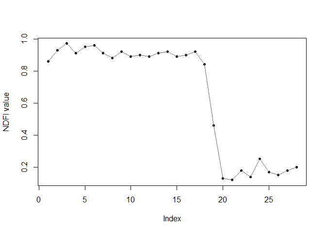
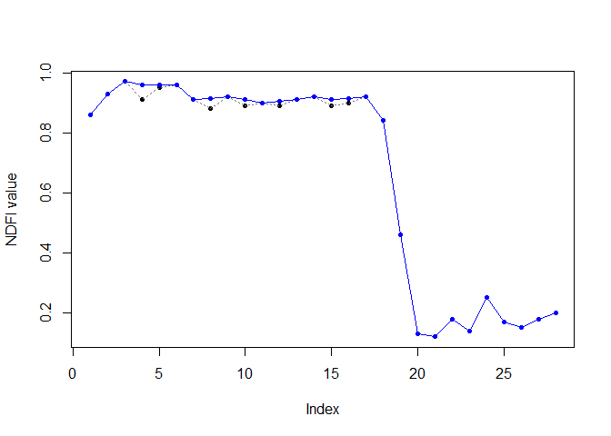
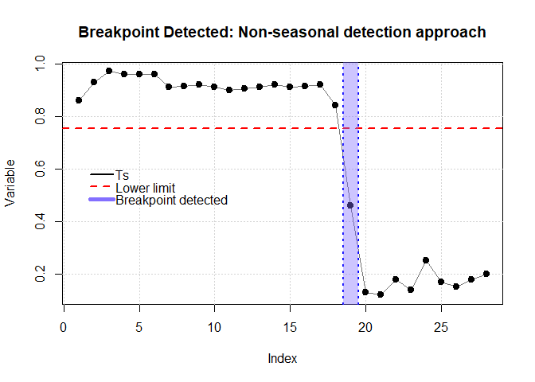
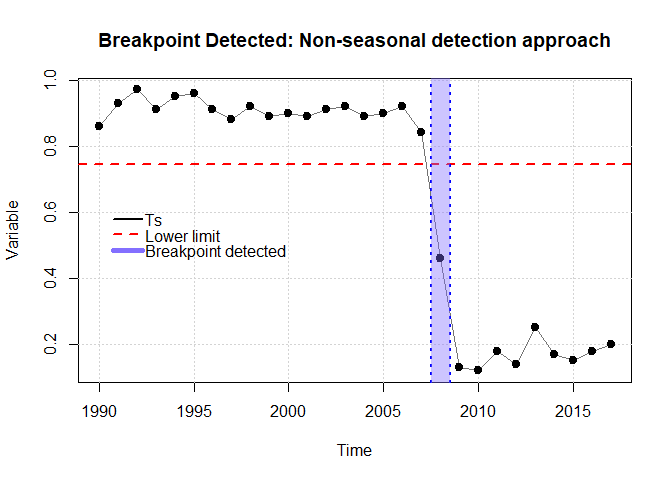
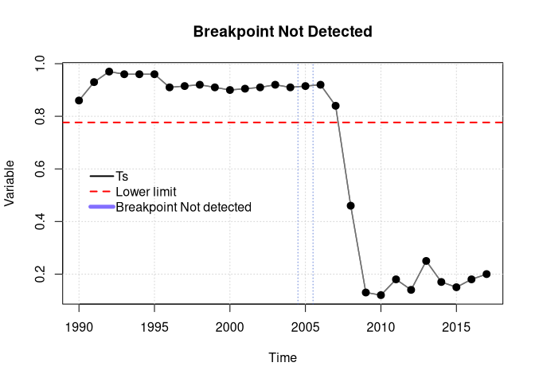
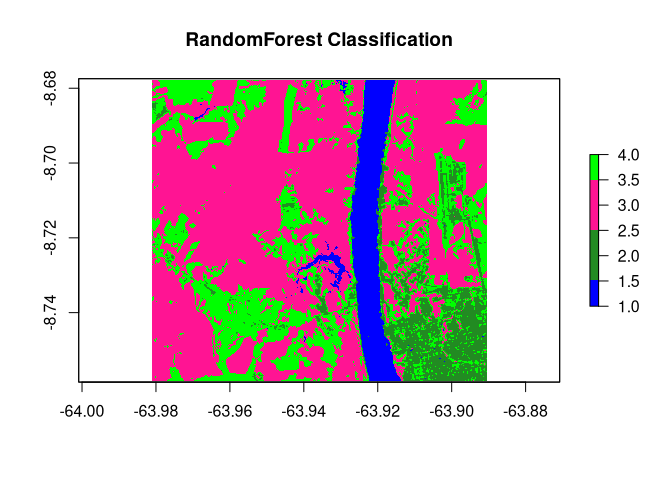
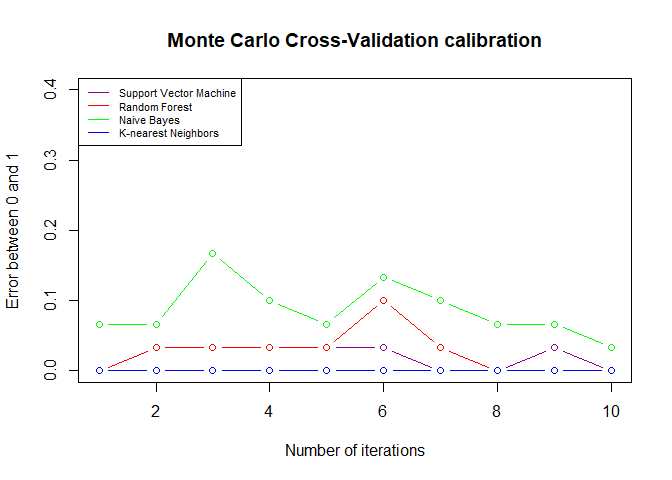
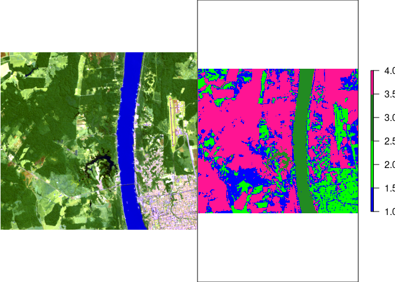
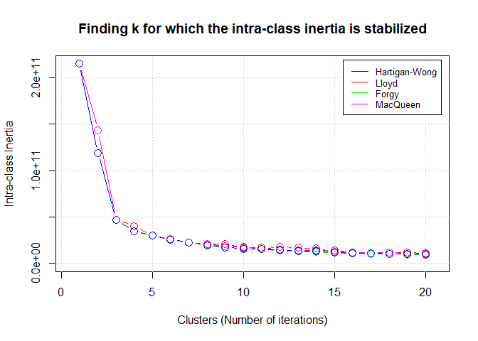

<!-- README.md is generated from README.Rmd. Please edit that file -->

# ForesToolboxRS 

[](https://opensource.org/licenses/MIT)
[](https://codecov.io/gh/ytarazona/ForesToolboxRS?branch=dev)
[](https://lifecycle.r-lib.org/articles/stages.html#experimental)
<!-- [](https://paypal.me/APROGIS?locale.x=es_XC) -->

> **Note!**: This package is still under construction


<!-- # Canadian Journal of Remote Sensing -->
<!-- This repository is part of the paper "Fusing Landsat and SAR data for mapping tropical deforestation through machine learning classification and the PVts-beta non-seasonal detection approach" submitted to [Canadian Journal of Remote Sensing](https://www.tandfonline.com/toc/ujrs20/current). -->

# Introduction

**ForesToolboxRS** is an R package providing a variety of tools and
algorithms for the processing and analysis of satellite images for the
various applications of Remote Sensing for Earth Observations. All
implemented algorithms are based on scientific publications.
<!--there should be a list of references-->

-   Tarazona, Y., Maria, Miyasiro-Lopez. (2020). Monitoring tropical
    forest degradation using remote sensing. Challenges and
    opportunities in the Madre de Dios region, Peru. Remote Sensing
    Applications: Society and Environment, 19, 100337.
-   Tarazona, Y., Mantas, V.M., Pereira, A.J.S.C. (2018). Improving
    tropical deforestation detection through using photosynthetic
    vegetation time series (PVts-β). Ecological Indicators, 94, 367 379.
-   Hamunyela, E., Verbesselt, J., Roerink, G., & Herold, M. (2013).
    Trends in spring phenology of western European deciduous forests.
    Remote Sensing,5(12), 6159-6179.
-   Souza Jr., C.M., Roberts, D.A., Cochrane, M.A., 2005. Combining
    spectral and spatialinformation to map canopy damage from selective
    logging and forest fires. Remote Sens. Environ. 98 (2-3), 329-343.
-   Adams, J. B., Smith, M. O., & Gillespie, A. R. (1993). Imaging
    spectroscopy: Interpretation based on spectral mixture analysis.
    In C. M. Pieters & P. Englert (Eds.), Remote geochemical analysis:
    Elements and mineralogical composition. NY: Cambridge Univ. Press
    145-166 pp.
-   Shimabukuro, Y.E. and Smith, J., (1991). The least squares mixing
    models to generate fraction images derived from remote sensing
    multispectral data. IEEE Transactions on Geoscience and Remote
    Sensing, 29, pp. 16-21.

**The PVts-Beta approach**, a non-seasonal detection approach, is
implemented in this package and can read time series, vector, matrix,
and raster data. Some functions of this package are intended to show, on
the one hand, some progress in methods for mapping deforestation and
forest degradation, and on the other hand, to provide some tools (not
yet available) for routine analysis of remotely detected data. Tools for
calibration of unsupervised and supervised algorithms through various
calibration approaches are some of the functions embedded in this
package. Therefore we sincerely hope that **ForesToolboxRS** can
facilitate different analyses and simple and robust processes in
satellite images

Available functions:

| Name of functions       | Description                                                                                                                                                                                                                                                                                                         |
|-------------------------|---------------------------------------------------------------------------------------------------------------------------------------------------------------------------------------------------------------------------------------------------------------------------------------------------------------------|
| **`pvts()`**            | This algorithm will allow to detect disturbances in the forests using all the available Landsat set. In fact, it can also be run with sensors such as MODIS.                                                                                                                                                        |
| **`pvtsRaster()`**      | This algorithm will allow to detect disturbances in the forests using all the available Landsat set. In fact, it can also be run with sensors such as MODIS.                                                                                                                                                        |
| **`smootH()`**          | In order to eliminate outliers in the time series, a temporary smoothing is used.                                                                                                                                                                                                                                   |
| **`mla()`**             | This developed function allows to execute supervised classification in satellite images through various algorithms.                                                                                                                                                                                                 |
| **`calmla()`**          | This function allows to calibrate supervised classification in satellite images through various algorithms and using approches such as Set-Approach, Leave-One-Out Cross-Validation (LOOCV), Cross-Validation (k-fold) and Monte Carlo Cross-Validation (MCCV).                                                     |
| **`rkmeans()`**         | This function allows to classify satellite images using k-means.                                                                                                                                                                                                                                                    |
| **`calkmeans()`**       | This function allows to calibrate the kmeans algorithm. It is possible to obtain the best k value and the best embedded algorithm in kmeans.                                                                                                                                                                        |
| **`coverChange()`**     | This algorithm is able to obtain gain and loss in land cover classification.                                                                                                                                                                                                                                        |
| **`linearTrend()`**     | Linear trend is useful for mapping forest degradation, land degradation, among others. This algorithm is capable of obtaining the slope of an ordinary least-squares linear regression and its reliability (p-value).                                                                                               |
| **`fusionRS()`**        | This algorithm allows to fusion images coming from different spectral sensors (e.g., optical-optical, optical and SAR or SAR-SAR). Among many of the qualities of this function, it is possible to obtain the contribution (%) of each variable in the fused image.                                                 |
| **`sma()`**             | The SMA assumes that the energy received, within the field of vision of the remote sensor, can be considered as the sum of the energies received from each dominant endmember. This function addresses a Linear Mixing Model.                                                                                       |
| **`ndfiSMA()`**         | The NDFI it is sensitive to the state of the canopy cover, and has been successfully applied to monitor forest degradation and deforestation in Peru and Brazil. This index comes from the endmembers Green Vegetation (GV), non-photosynthetic vegetation (NPV), Soil (S) and the reminder is the shade component. |
| **`tct()`**             | The Tasseled-Cap Transformation is a linear transformation method for various remote sensing data. Not only can it perform volume data compression, but it can also provide parametersassociated with the physical characteristics, such as brightness, greenness and wetness indices.                              |
| **`gevi()`**            | Greenness Vegetation Index is obtained from the Tasseled Cap Transformation.                                                                                                                                                                                                                                        |
| **`MosaicFreeCloud()`** | A three-step algorithm for creating a mosaic from satellite imagery (see notes).                                                                                                                                                                                                                                    |

# Installation

To install the latest development version directly from the GitHub
repository. Before running **ForesToolboxRS**, it is necessary to
install the **remotes** package:

``` r
library(remotes)
install_github("ytarazona/ForesToolboxRS")
suppressMessages(library(ForesToolboxRS))
```

# Examples

## 1. Breakpoint in an NDFI series (**`pvts`** function)

Here an Normalized Difference Fraction Index (NDFI) between 2000 and
2019 (28 data) was used. One NDFI for each year was obtained. The idea
is to detect a change in 2008 (position 19). The NDFI value ranges from
-1 to 1.

``` r
library(ForesToolboxRS)
#> Registered S3 method overwritten by 'quantmod':
#>   method            from
#>   as.zoo.data.frame zoo
# NDFI series
ndfi <- c(0.86, 0.93, 0.97, 0.91, 0.95, 0.96, 0.91,
          0.88, 0.92, 0.89, 0.90, 0.89, 0.91, 0.92,
          0.89, 0.90, 0.92, 0.84, 0.46, 0.13, 0.12,
          0.18, 0.14, 0.25, 0.17, 0.15, 0.18, 0.20)
          
# Plot
plot(ndfi, pch = 20, xlab = "Index", ylab = "NDFI value")
lines(ndfi, col = "gray45")
```



### 1.1 Applying a smoothing (the **`smootH()`** function)

Before detecting a breakpoint, it is necessary to apply smoothing to
remove any existing outliers. So, we’ll use the **`smootH()`** function
from the **ForesToolboxRS** package. The mathematical approach of this
method of removing outliers implies the non-modification of the first
and last values of the historical series.

If the idea is to detect changes in 2008 (position 19), then we will
smooth the data only up to that position (i.e., `ndfi[1:19]`). Let’s do
that.

``` r
ndfi_smooth <- ndfi
ndfi_smooth[1:19] <- smootH(ndfi[1:19])

# Let's plot the real series
plot(ndfi, pch = 20, xlab = "Index", ylab = "NDFI value")
lines(ndfi, col = "gray45", lty = 3)
# Let's plot the smoothed series
lines(ndfi_smooth, col = "blue", ylab = "NDFI value", xlab = "Time")
points(ndfi_smooth, pch = 20, col = "blue")
```



> **Note**: You can change the detection threshold if you need to.

### 1.1 Breakpoint using a specific index (vector)

To detect changes, either we can have a vector (using a specific
index/position) or a time series as input. Let’s first detect changes
with a vector, a then with a time series.

We use the output of the **`smootH()`** function (**`ndfi_smooth()`**).

Parameters:

-   **x**: smoothed series preferably to optimize detection
-   **startm**: monitoring year, index 19 (i.e., year 2008)
-   **endm**: year of final monitoring, index 19 (i.e., also year 2008)
-   **threshold**: detection threshold (for NDFI series we will use 5).
    If you are using PV series, NDVI and EVI series you can use 5, 3 and
    3 respectively. Please see [Tarazona et
    al. (2018)](https://www.sciencedirect.com/science/article/abs/pii/S1470160X18305326)
    for more details.

``` r
# Detect changes in 2008 (position 19)
cd <- pvts(x = ndfi_smooth, startm = 19, endm = 19, threshold = 5)
plot(cd)
```



### 1.3 Breakpoint using Time Series

Parameters:

-   **x**: smoothed series preferably to optimize detection
-   **startm**: monitoring year, in this case year 2008.
-   **endm**: year of final monitoring, also year 2008.
-   **threshold**: detection threshold (for NDFI series we will use 5).
    If you are using PV series, NDVI and EVI series you can use 5, 3 and
    3 respectively. Please see [Tarazona et
    al. (2018)](https://www.sciencedirect.com/science/article/abs/pii/S1470160X18305326)
    for more details.

``` r
# Let´s create a time series of the variable "ndfi"
ndfi_ts <- ts(ndfi, start = 1990, end = 2017, frequency = 1)

# Applying a smoothing
ndfi_smooth <- ndfi_ts
ndfi_smooth[1:19] <- smootH(ndfi_ts[1:19])

# Detect changes in 2008
cd <- pvts(x = ndfi_ts, startm = 2008, endm = 2008,  threshold = 5)
plot(cd)
```



### 1.4 Breakpoint Not Detected

Parameters:

-   **x**: smoothed series preferably to optimize detection
-   **startm**: monitoring year, index 16 (i.e., year 2005)
-   **endm**: year of final monitoring, index 16 (i.e., also year 2005)
-   **threshold**: detection threshold (for NDFI series we will use 5).
    If you are using PV series, NDVI and EVI series you can use 5, 3 and
    3 respectively. Please see [Tarazona et
    al. (2018)](https://www.sciencedirect.com/science/article/abs/pii/S1470160X18305326)
    for more details.

``` r
# Detect changes in 2005
cd <- pvts(x = ndfi_smooth, startm = 2005, endm = 2005,  threshold = 5)
plot(cd)
```



## 2. Supervised classification in Remote Sensing (the **`mla()`** function)

For this tutorial, Landsat-8 OLI image and signatures were used. To
download data please follow this codes:

``` r
# Data Preparation
dir.create("testdata")
#> Warning in dir.create("testdata"): 'testdata' already exists
# downloading the image
download.file("https://github.com/ytarazona/ft_data/raw/main/data/LC08_232066_20190727_SR.zip",
              destfile = "testdata/LC08_232066_20190727_SR.zip")
# unziping the image
unzip("testdata/LC08_232066_20190727_SR.zip", exdir = "testdata")
# downloading the signatures
download.file("https://github.com/ytarazona/ft_data/raw/main/data/signatures.zip",
              destfile = "testdata/signatures.zip")
# unziping the signatures
unzip("testdata/signatures.zip", exdir = "testdata")
```

### 2.1 Applying Random Forest (supervised classification)

Parameters:

-   **img**: RasterStack (Landsat 8 OLI)
-   **endm**: Signatures, **sf** object (shapefile)
-   **model**: Random Forest like ‘randomForest’
-   **training\_split**: 80 percent to train and 20 percent to validate
    the model

``` r
library(ForesToolboxRS)
library(raster)
#> Loading required package: sp
library(sf)
#> Linking to GEOS 3.8.1, GDAL 3.1.4, PROJ 6.3.2

# Read raster
image <- stack("testdata/LC08_232066_20190727_SR.tif")

# Read signatures
sig <- read_sf("testdata/signatures.shp")

# Classification with Random Forest
classRF <- mla(img = image, model = "randomForest", endm = sig, training_split = 80)
#> 4 cores detected, using 3

# Results
print(classRF)
#> ******************** ForesToolboxRS CLASSIFICATION ********************
#> 
#> ****Overall Accuracy****
#>       Accuracy          Kappa  AccuracyLower  AccuracyUpper   AccuracyNull 
#>   9.687500e+01   9.582518e+01   8.916295e+01   9.961928e+01   2.812500e+01 
#> AccuracyPValue 
#>   7.358300e-30 
#> 
#> ****Confusion Matrix****
#>                     1        2   3   4 Total Users_Accuracy Commission
#> 1                  18  0.00000   0   0    18      100.00000    0.00000
#> 2                   0 15.00000   0   0    15      100.00000    0.00000
#> 3                   0  0.00000  16   0    16      100.00000    0.00000
#> 4                   0  2.00000   0  13    15       86.66667   13.33333
#> Total              18 17.00000  16  13    NA             NA         NA
#> Producer_Accuracy 100 88.23529 100 100    NA             NA         NA
#> Omission            0 11.76471   0   0    NA             NA         NA
#> 
#> ****Classification Map****
#> class      : RasterLayer 
#> dimensions : 301, 337, 101437  (nrow, ncol, ncell)
#> resolution : 0.0002694946, 0.0002694946  (x, y)
#> extent     : -63.98125, -63.89043, -8.758574, -8.677456  (xmin, xmax, ymin, ymax)
#> crs        : +proj=longlat +datum=WGS84 +no_defs 
#> source     : memory
#> names      : layer 
#> values     : 1, 4  (min, max)
```

``` r
# Classification
colmap <- c("#0000FF","#228B22","#FF1493", "#00FF00")
plot(classRF$Classification, main = "RandomForest Classification", col = colmap, axes = TRUE)
```



### 2.2 Calibrating with Monte Carlo Cross-Validation (**`calmla()`** function)

**`ForesToolboxRS`** has several approaches to calibrate machine
learning algorithms such as **Set-Approach**, **Leave One Out
Cross-Validation (LOOCV)**, **Cross-Validation (k-fold)** and **Monte
Carlo Cross-Validation (MCCV)**.

Parameters:

-   **img**: RasterStack (Landsat-8 OLI)
-   **endm**: Signatures
-   **model**: c(“svm”, “randomForest”, “naiveBayes”, “knn”). Machine
    learning algorithms: Support Vector Machine, Random Forest, Naive
    Bayes, K-nearest Neighbors
-   **training\_split**: 70
-   **approach**: “MCCV”
-   **iter**: 10

> **Warning!**: This function may take some time to process depending on
> the volumen of the data.

``` r
cal_ml <- calmla(img = image, endm = sig,
                 model = c("svm", "randomForest", "naiveBayes", "knn"),
                 training_split = 70, approach = "MCCV", iter = 10)
#> Loading required package: lattice
#> Loading required package: ggplot2
```

``` r
# Calibration result
plot(
  cal_ml$svm_mccv,
  main = "Monte Carlo Cross-Validation calibration",
  col = "darkmagenta",
  type = "b",
  ylim = c(0, 0.4),
  ylab = "Error between 0 and 1",
  xlab = "Number of iterations"
)
lines(cal_ml$randomForest_mccv, col = "red", type = "b")
lines(cal_ml$naiveBayes_mccv, col = "green", type = "b")
lines(cal_ml$knn_mccv, col = "blue", type = "b")
legend(
  "topleft",
  c(
    "Support Vector Machine",
    "Random Forest",
    "Naive Bayes",
    "K-nearest Neighbors"
  ),
  col = c("darkmagenta", "red", "green", "blue"),
  lty = 1,
  cex = 0.7
)
```



### 3. Unsupervised classification in Remote Sensing (**`rkmeans`** function)

For this tutorial, the same images was used.

#### 3.1 Applying K-means

Parameters:

-   **img**: RasterStack (Landsat 8 OLI)
-   **k**: the number of clusters
-   **algo**: “MacQueen”

``` r
library(ForesToolboxRS)
library(raster)

# Read raster
image <- stack("testdata/LC08_232066_20190727_SR.tif")

# Classification with K-means
classKmeans <- rkmeans(img = image, k = 4, algo = "MacQueen")
```

``` r
# Plotting classification
par(mfrow = c(1, 2), mar = c(3, 4, 3, 3))
# Landsat-8 image
plotRGB(image, 6, 5, 2, stretch = "lin")
# Classification
colmap <- c("#0000FF","#00FF00","#228B22", "#FF1493")
plot(classKmeans, main = "K-means Classification", col = colmap, axes = FALSE)
```



### 3.2 Calibrating k-means (the **`calkmeans()`** function)

This function allows to calibrate the *kmeans* algorithm. It is possible
to obtain the best value and the best embedded algorithm in kmeans. If
we want to find the optimal value of (clusters or classes), so we must
put as an argument of the function. Here, we are finding k for which the
intra-class inertia is stabilized.

Parameters:

-   **img**: RasterStack (Landsat 8 OLI)
-   **k**: The number of clusters
-   **iter.max**: The maximum number of iterations allowed. Strictly
    related to k-means
-   **algo**: It can be “Hartigan-Wong”, “Lloyd”, “Forgy” or “MacQueen”.
    Algorithms embedded in k-means
    <!--JN: Algorithms embedded in k-means???-->
-   **iter**: Iterations number to obtain the best k value

``` r
# Elbow method
best_k <- calkmeans(img = image, k = NULL, iter.max = 10,
                    algo = c("Hartigan-Wong", "Lloyd", "Forgy", "MacQueen"),
                    iter = 20)
```

``` r
plot(best_k)
```


